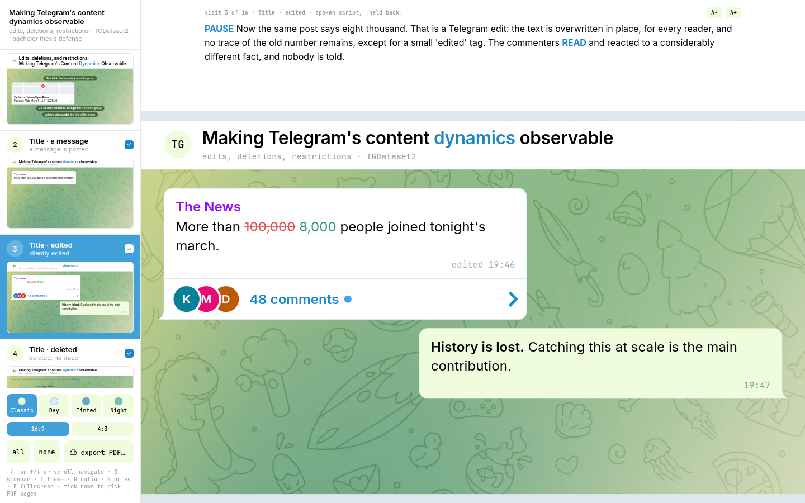

# TGDataset2: the thesis defense deck

A ten-minute bachelor thesis defense for *Edits, Deletions, and Restrictions: Making Telegram's Content Dynamics Observable at Scale*, Sapienza, A.Y. 2025/2026.

The thesis is about what happens to Telegram messages after they are posted, so the deck argues in the medium it studies. Every slide is a channel view: a header, then messages in reading order. The world speaks in incoming bubbles on the left, the thesis answers in own bubbles on the right, and a deleted message is a dashed ghost bubble, the one device Telegram lacks, since the real client renders nothing where a message used to be. Sixteen slides, run from one container in development, built to a static site or to one self-contained file.

**Live deck:** <https://strascico-slides.tintan.do/> **PDF:** [`portable/16-9/deck-classic.pdf`](portable/16-9/deck-classic.pdf), the whole deck in Classic at one page a slide.

## Screenshot



The presenter's window, here on the 'edit' slide in Classic: a post whose crowd figure was overwritten in place, and the takeaway answering it on the right. The rail is a chat list, one row per slide with a live thumbnail, and the spoken script sits above the stage. The room gets a second window of the same browser, the same stage with the rail and the notes closed. The same slide is page 3 of the Classic PDF above.

## Built with

Hand-written HTML, CSS and JavaScript, and nothing at runtime. No Reveal.js, no Slidev, no MDX: a slide framework brings its own grammar of layouts and transitions, and here that grammar is Telegram's (bubbles, tails, reply quotes, poll bars, restriction interstitials), so the framework was the part that got cut. One CSS file per element in [`slides/assets/elements/`](slides/assets/elements/README.md), verified against Telegram Desktop v6.9.3 and its `lib_ui` pin; the four themes are the client's own settings cards, their colors read out of the theme files rather than approximated by eye. The dev server is 117 lines of dependency-free Node holding an SSE stream open for live reload, and esbuild runs at build time only, so the published deck ships no third-party JavaScript.

Being a web page rather than a slide file is what makes the look of the deck a setting instead of a rewrite. Every color is a CSS custom property keyed off a single `data-theme` attribute on `<html>`, so switching between the four themes is one attribute swap and no slide knows which one is on. Aspect ratio works the same way: `data-ratio="43"` narrows the slide from 1280 to 960 while the height stays 720, so the type scale is untouched and the thread reflows into the narrower column, where a deck exported to a fixed 16:9 would have to be laid out a second time. `T` and `R` do both live, in front of the room; `?theme=` and `?ratio=` do them by URL, which is how `export-pdf.sh --all` writes all eight PDFs, four themes across two ratios, from the same slides. It is worth having because the room is not knowable in advance: a hall with the blinds up washes out the dark deck, and a projector that only does 4:3 crops the wide one.

## Running it

```
docker compose up          # → http://localhost:8080
```

One `node:22-alpine` container, `tgdataset2-dev`, bind-mounted on `slides/`, so edits on disk are served immediately and the browser reloads itself. It binds to localhost and is never on the internet. Without Docker: `node slides/server/server.js`.

Keys: `←` / `→` or scroll to navigate, `S` sidebar, `T` themes, `R` aspect ratio, `N` speaker notes, `F` fullscreen. Two windows of the same browser follow each other: a laptop window with notes, a projector window without.

## Further reading

- [`docs/viewer.md`](docs/viewer.md): every control, what persists and where, the notes panel, the themes, 16:9 against 4:3.
- [`docs/url-flags.md`](docs/url-flags.md): the query flags the viewer reads, and why the preview flags never persist.
- [`docs/pdf-export.md`](docs/pdf-export.md): exporting from the viewer or the shell, and the theme-by-ratio matrix for a projector you have not met.
- [`docs/hosting.md`](docs/hosting.md): self-hosting behind a Cloudflare tunnel, and the single-file portable build that opens from a USB stick with no network at all.

## Layout

```
slides/index.html      viewer shell: rail + stage + HUD
slides/slides/         one fragment per slide; order = filename sort
slides/assets/         deck.css + deck.js, and elements/, the device library
slides/server/         dependency-free Node server (static, /api/slides, SSE)
slides/export-pdf.sh   renders deck.pdf via headless Chrome
deploy/                build.mjs, Dockerfile, nginx.conf, compose.yml, pages/ (Cloudflare Pages extras)
tools/                 speech_time.py, times the script against the 10:00 budget
```

Alongside: `../thesis` holds the text and its canonical figures (the copies here follow it), `../analysis` the notebooks that produced them.

## License

Code and content: MIT, see `../LICENSE`. Bundled third-party assets are listed in [`ATTRIBUTION.md`](ATTRIBUTION.md).
